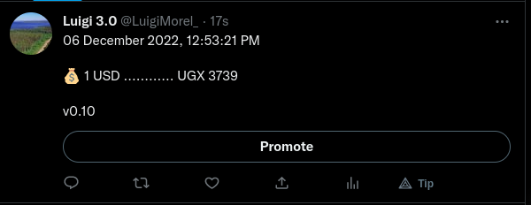

# Introduction

A twitter bot that performs currency conversion and automatically makes a tweet every after 24 hours by relying on a channel.

 

### TO DO

[x] - Add cron jobs to publish tweets automatically once a day.(I used a channel instead)

## Tools

- Golang
- [API Layer currency convert endpoint](https://api.apilayer.com/)
- [godotenv](https://github.com/joho/godotenv) - for handling env variables
- [Twitter API wrapper](https://github.com/dghubble/go-twitter) - for handling twitter events
- [OAuth1](https://github.com/dghubble/oauth1) - provides a Go implementation of the OAuth 1 spec to allow end-users to authorize a client

### Resources

- [Twitter developers' documentation](https://developer.twitter.com/en)
- [API Layer](https://api.apilayer.com/)
